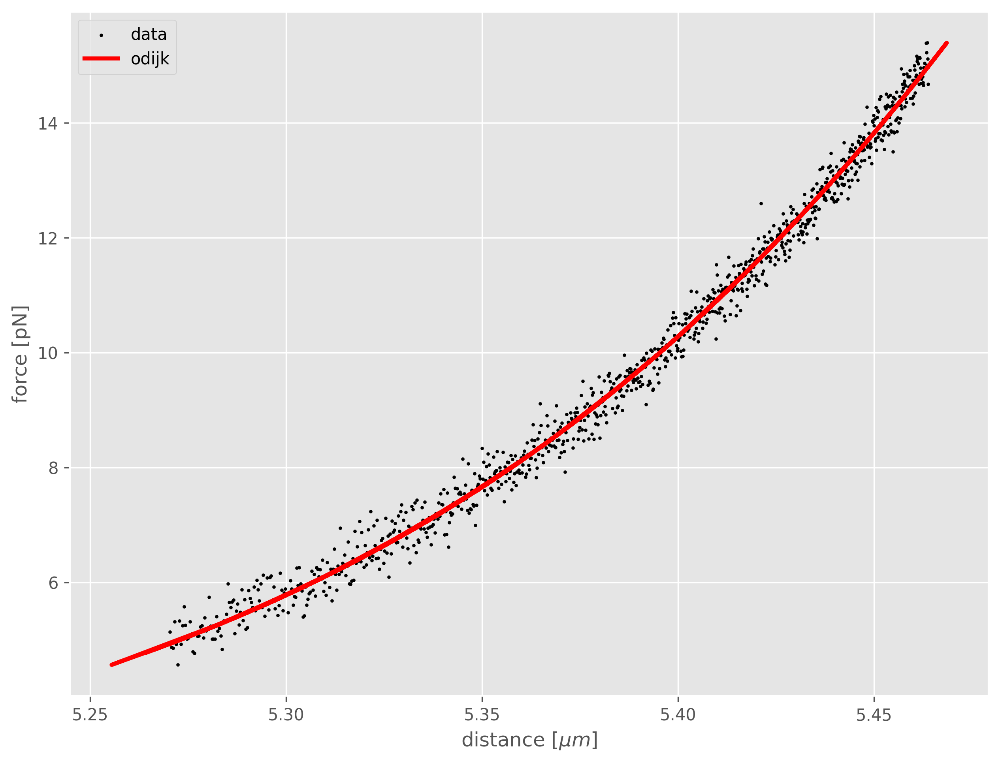

# Worm-Like Chain Parameters Estimation Library (wlc)

[](https://opensource.org/licenses/MIT)
[](https://www.python.org/downloads/release)

## Overview

The Worm-Like Chain (WLC) Parameters Estimation Library is a Python package designed for estimating the main parameters of a Worm-Like Chain molecule from force-extension measurements. This library is a valuable tool for researchers and scientists working in biophysics, polymer physics, and related fields.

## Features

- **Parameter Estimation:** Accurately estimate key parameters of a Worm-Like Chain molecule such as contour length, persistance length, etc.
- **Flexible:** Compatible with a variety of force-extension measurement data.
- **Pythonic:** Clean and easy-to-use API for seamless integration into your projects.

## Installation

To install the wlc library and its dependencies, run:

```bash
pip install git+https://github.com/franciscopalmeromoya/wlc-fitting.git
```

For additional dependencies, please refer to the `requirements.txt` file.

## Usage

Here's a simple example demonstrating how to use the library:

```python
import wlc

# Odijk model
model = wlc.fitting.WormLikeChain(model="odijk")
```
```console
Odidjk worm-like chain model.

    .. math::
        d = L_c \left( 1 - \frac{1}{2}\sqrt{\frac{k_BT}{FL_p}} + \frac{F}{S}

    Parameters
    ----------
    F : array-like
        Required force to extend a worm-like chain. Units: [pN]
    kBT : float
        Boltzman contant times Temperature. Units: [pN*nm]
    Lc : float 
        Contour length. Units: [nm]
    Lp : float
        Persistance length. Units: [nm]
    S : float
        Stretch modulus. Units: [pN]

    Outputs
    -------
    d : array-like
        Distance between end-points. Units: [um]

    Odijk, T. 
    Stiff Chains and Filaments under Tension 
    Macromolecules 1995 28 (20) 
    7016-7018 doi: 10.1021/ma00124a044
```
```python
# Compile model
model.compile(params)
# Fitting to the data
df = model.fit(data, min_delta=params["min_delta"], max_iters=params["max_iters"], verbose=True)
```
```console
100%|██████████| 20/20 [00:00<00:00, 2450.66it/s]
```
```python
# Plot results
model.plot(data)
```
<p align="center">

</p>

```python
# Summary of fitting statistics
model.stats()
```
```console
[[Model]]
    Model(odijk)
[[Fit Statistics]]
    # fitting method   = leastsq
    # function evals   = 17
    # data points      = 1000
    # variables        = 3
    chi-square         = 0.02758826
    reduced chi-square = 2.7671e-05
    Akaike info crit   = -10492.1203
    Bayesian info crit = -10477.3970
    R-squared          = 0.99035248
[[Variables]]
    kBT:  4.185289 (fixed)
    Lc:   5576.19172 +/- 7.52744519 (0.13%) (init = 5600)
    Lp:   60.0419756 +/- 2.27049604 (3.78%) (init = 60.04198)
    S:    1073.45093 +/- 56.8841384 (5.30%) (init = 1255)
[[Correlations]] (unreported correlations are < 0.100)
    C(Lc, Lp) = -0.9964
    C(Lc, S)  = +0.9906
    C(Lp, S)  = -0.9765
```


